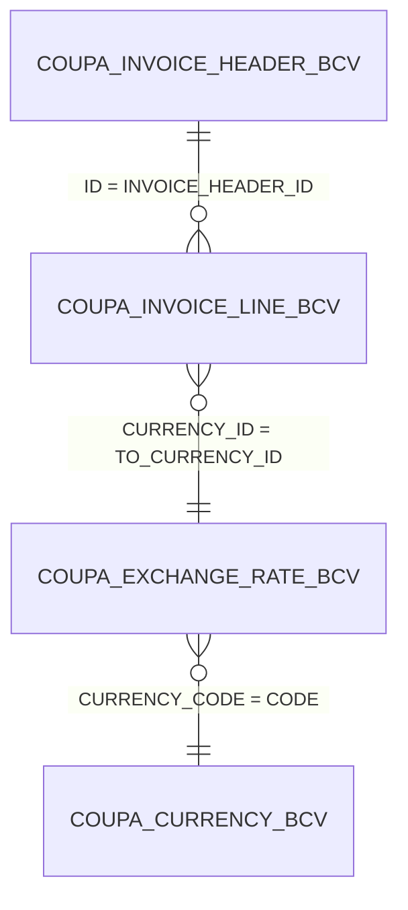

## Data Model & Key Field Relationships

### 1. Tables Overview

| Table Name                      | Purpose                                    | Key Fields                                         |
|----------------------------------|--------------------------------------------|----------------------------------------------------|
| `COUPA_INVOICE_HEADER_BCV` (CIH) | Main invoice record (header)               | `ID`, `INVOICE_NUMBER`, `PAYMENT_DATE`, `AMOUNT_DUE` |
| `COUPA_INVOICE_LINE_BCV` (CIL)   | Line-level invoice details                 | `ID`, `INVOICE_HEADER_ID`, `CURRENCY_ID`           |
| `COUPA_EXCHANGE_RATE_BCV` (CRB)  | Stores currency exchange rates             | `FROM_CURRENCY_ID`, `TO_CURRENCY_ID`, `RATE`, `CURRENCY_CODE` |
| `COUPA_CURRENCY_BCV` (CCB)       | Reference for all currencies (not joined in query, optional) | `CODE`, `NAME`                         |

---

### 2. Table Relationships (Joins)

- **Invoice Header to Invoice Line**
  - `CIH.ID = CIL.INVOICE_HEADER_ID`
  - Each invoice header (`CIH`) may have multiple related invoice lines (`CIL`).

- **Invoice Line to Exchange Rate**
  - `CIL.CURRENCY_ID = CRB.TO_CURRENCY_ID`
  - Connects the invoice line’s currency to the corresponding exchange rate for conversion.

- **Exchange Rate to Currency Table** (optional, commented in SQL)
  - `CRB.CURRENCY_CODE = CCB.CODE`
  - Provides descriptive currency names/details.

---

### 3. Relationship Diagram

## Prompts

### CX 

[CX] Trend Analysis: Customer Satisfaction Scores by Month
- Dataset: CX_SURVEY_RESULTS
- Key metrics: CSAT_SCORE, CUSTOMER_ID, SURVEY_DATE
- Filters: SURVEY_DATE between '2024-01-01' and '2024-12-31'
- Output: Line chart + 2-sentence summary
- Business question: Have CSAT scores improved post-launch of new self-service portal?

### AR by Status
[AR] Summary: Total Receivables by Payment Status
- Dataset: ACCOUNTS_RECEIVABLE
- Key metrics: INVOICE_AMOUNT, PAYMENT_STATUS, CUSTOMER_ID
- Filters: PAYMENT_STATUS in ('Paid', 'Overdue', 'Pending')
- Output: Summary table

### AR_Aging
[AR_AGING] Outlier Detection: Accounts with 90+ Days Overdue
- Dataset: AR_AGING_DETAIL
- Key metrics: CUSTOMER_NAME, DAYS_OVERDUE, OUTSTANDING_BALANCE
- Filters: DAYS_OVERDUE > 90
- Output: Table of accounts + highlight top 5

### Coupa AP
[Coupa_AP] Payment Timeliness Analysis
- Dataset: Coupa_AP
- Key metrics: PAYMENT_DATE, INVOICE_DATE, VENDOR_NAME, PAID_AMOUNT
- Filters: PAYMENT_DATE between '2024-01-01' and '2024-03-31'
- Output: Bar chart by vendor + summary
- Business question: Are any vendors consistently paid late?

## Quick Reference Table

| Prefix           | Domain/Source         | Use For...                        |
|------------------|----------------------|------------------------------------|
| **[CX]**         | Customer Experience  | NPS, CSAT, Contact drivers         |
| **[Finance]**    | Finance General      | P&L, budgets, actuals, forecasts   |
| **[AR]**         | Accounts Receivable  | Invoices, collections, status      |
| **[AP]**         | Accounts Payable     | Vendor payments, bills             |
| **[AR_AGING]**   | AR Aging Reports     | Overdue, risk, exposure            |
| **[Coupa_AR]**   | Coupa Receivables    | AR via Coupa integration           |
| **[Coupa_AP]**   | Coupa Payables       | AP via Coupa integration           |
| **[Coupa_ar_aging]** | Coupa AR Aging   | Coupa-specific aging analysis      |
